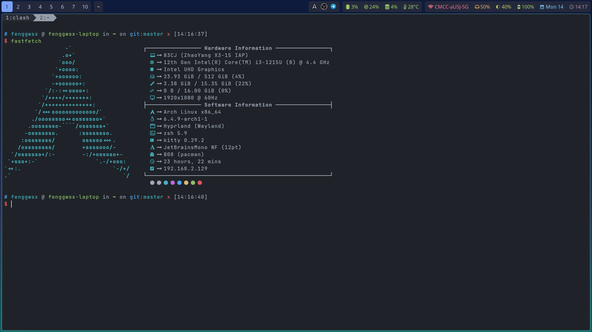
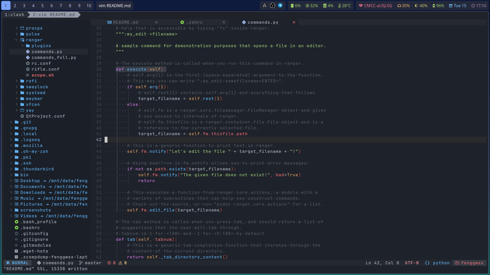
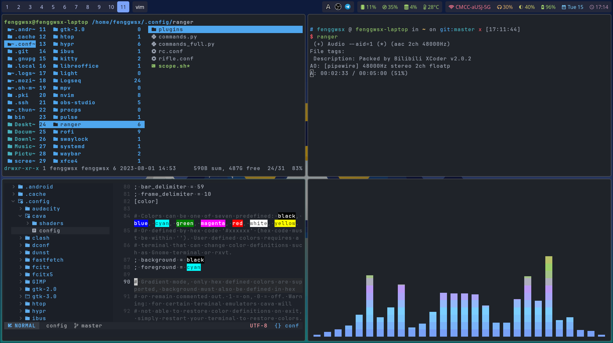

# About This Repository

This repository stores the user configuration files of my Hyprland desktop. Everyone can clone and use it. However, I highly suggest you **TAKE THESE CONFIGURATION FILES AS A REFERENCE ONLY** because they may contain something related to my computer so they may not work well if you simply clone the whole repository into your own computer. Also, I suggest you install the packages and softwares before using my configuration files.

# Screenshots





# System

- Linux distribution: Arch Linux
- File system: btrfs
- Network: NetworkManager
- Display server protocol: Wayland
- Window manager: Hyprland
- Login manager: sddm (Tokyo night theme)
- Shell: zsh (oh my zsh)
- Notification daemon: dunst
- Authentication agent: polkit kde agent
- Status bar: waybar
- App launcher: rofi
- Wallpaper: hyprpaper
- Screen locker: swaylock-effects
- Input method framework: fcitx5
- Input method: rime

# Softwares

- Terminal emulator: kitty
- Web browser: firefox
- Text editor: neovim
- File manager: ranger
- Note taking: logseq
- Pdf reader: zathura
- Image viewer: imv
- Video player: mpv
- Office: libreoffice
- Screenshot: hyprshot
- Screen recorder: obs studio
- Chatting: telegram
- E-mail client: better bird
- Image editor: gimp
- audio editor: audacity
- Snapshot manager: timeshift

# Utilities

- fastfetch (faster and more functional than neofetch)
- lsd (ls with icons) -> ls
- duf -> df
- dust -> du
- zoxide (a smarter cd) -> cd
- bat -> cat
- htop -> top
- dog -> dig

# How to Use

## Install the Basic Linux System

Before using these configuration files, you should install a pure linux system first. Generally, any linux distribution is okay, but I recommend Arch Linux because it doesn't contain any additional packages.

If you decide to install Arch, you can use `archinstall` and select the minimal preset, or manually install it with `pacstrap`.

## Install Hyprland and Some Essential Softwares

Installing Hyprland is quite easy. For Arch users, simply run the following command line and Hyprland will be installed.

```sh
sudo pacman -S hyprland
```

After installing it successfully, simply run `Hyprland` in a tty and you will see the Hyprland desktop.

NOTE: If you have already installed other desktop environments (or window managers), I suppose a login manager like sddm has also been installed. In such case, you can enter Hyprland by selecting `Hyprland` in sddm.

The essential softwares includes sddm (a login manager), zsh, kitty (a terminal emulator), waybar (a status bar written in C), rofi (an application launcher), dunst (notification daemon), polkit kde agent (an authentication agent), pipewire (includes pipewire-audio), qt5-wayland, qt6-wayland. If you lack any of them, just install it.

Then, you can copy the corresponding config folders into `~/.config/*`

## Font

I use `JetBrainsMono Nerd Font` in kitty and neovim and it works well. You can use other fonts, but some icons might not be rendered correctly.

## Take a Snapshot

If you reach this step, you are near to success, but before champagning, I suggest taking a snapshot and you can continue configuring other softwares & utilities more freely.

## See Also

Hyprland official website: [https://hyprland.org/](https://hyprland.org/)
Oh-my-zsh official website: [https://ohmyz.sh/](https://ohmyz.sh/)
Nvchad official website: [https://nvchad.com/](https://nvchad.com/)
Arch wiki: [https://wiki.archlinux.org/](https://wiki.archlinux.org/)
